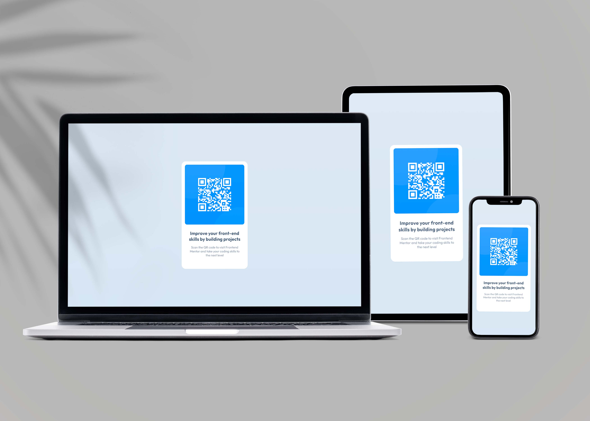

<h1 align="center">
  🔥 QR Code Component
</h1>

🚀 Card para exposição de QR code

  
  
  
  
  

 <a href="#status">Status</a> •
 <a href="#features">Features</a> • 
 <a href="#tecnologias">Tecnologias</a> • 
 <a href="#autor">Autor</a>

<h4 align="center" id="status"> 
	🚧  QR Code Component 🚀 Pronto...  🚧
</h4>

<h3 id="features"> 📝 Features</h3>

- [x] Exposição de QR Code
- [ ] Geração de QR Code

<h3 id="tecnologias">⚒️ Tecnologias </h3>

As seguintes ferramentas foram usadas na construção do projeto:

- [HTML5](https://developer.mozilla.org/en-US/docs/Glossary/HTML5)
- [CSS3](https://developer.mozilla.org/pt-BR/docs/Web/CSS)

<h3 id="autor">🧔 Autor</h3>

 
  
 <h3 style="margin: 0;">Diogo Kappaun 🚀</h3>

Feito com ❤️ por Diogo Kappaun 👋🏽 Entre em contato!

 
